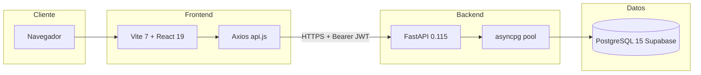
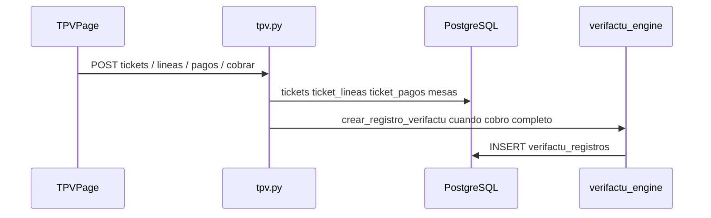
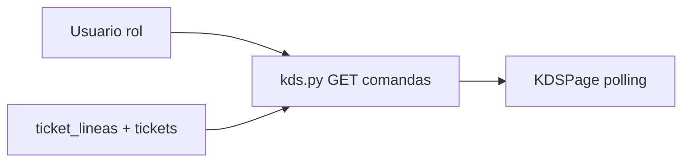
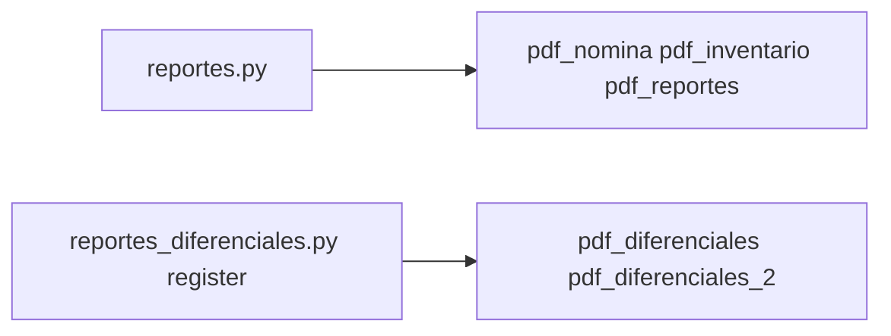
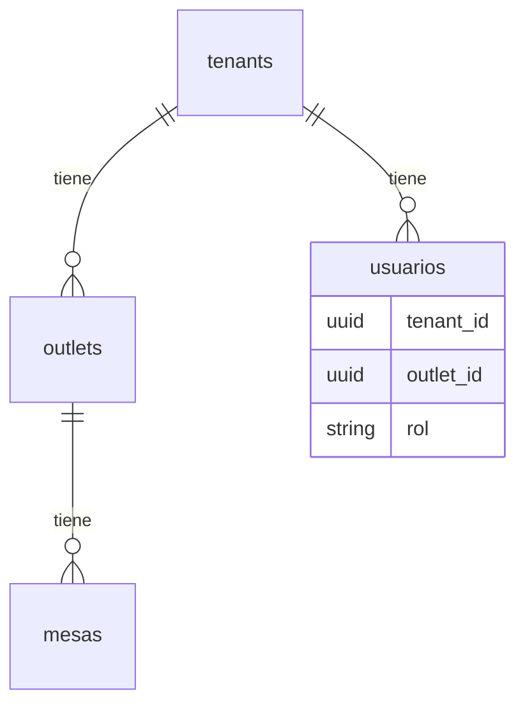

# HorecaSO — Radiografía / mapa del proyecto

Documento técnico de **arquitectura y cableado** entre capas. No sustituye al [PRD_HorecaSO.md](PRD_HorecaSO.md) (esquema SQL completo) ni al [STEP_HORECASO.md](STEP_HORECASO.md) (estado funcional y fases).

| Documento | Uso |
|-----------|-----|
| [STEP_HORECASO.md](STEP_HORECASO.md) | Qué está hecho, fases, APIs resumidas, deploy |
| [BITACORA_HORECASO.md](BITACORA_HORECASO.md) | Estado del repo inspeccionado (routers, rutas, SQL en disco) |
| [SCHEMA_BASE_DATOS.md](SCHEMA_BASE_DATOS.md) | Referencia de tablas Supabase |
| [PRD_HorecaSO.md](PRD_HorecaSO.md) | Tablas, reglas de negocio, Verifactu |
| [BUGS_Y_SOLUCIONES.md](BUGS_Y_SOLUCIONES.md) | Bugs y fixes detallados |
| [.cursorrules](.cursorrules) | Convenciones de código obligatorias |

**Mantenimiento:** actualizar este archivo cuando se añada un router FastAPI, una ruta React relevante, o una migración SQL que cambie flujos críticos.

---

## 1. Vista de sistema



- **Frontend:** `VITE_API_URL` en build (p. ej. `https://<backend>.onrender.com/api`). Si es relativo, en dev suele apuntar al proxy `/api`. Ver [frontend/src/services/api.js](frontend/src/services/api.js).
- **Backend:** [backend/config.py](backend/config.py) — `DATABASE_URL`, `SECRET_KEY_AUTH`, `ALLOWED_ORIGINS` (CORS), claves Groq/SendGrid cuando apliquen.
- **BD:** pool con `statement_cache_size=0` por pgbouncer — [backend/database.py](backend/database.py).

---

## 2. Monorepo — árbol lógico

```
HorecaSO/
├── backend/                 # API Python
│   ├── main.py              # App factory: routers, CORS, SlowAPI, lifespan, /api/health
│   ├── config.py            # pydantic-settings
│   ├── database.py          # Pool asyncpg + get_db()
│   ├── auth/                # JWT, Depends, require_roles
│   ├── routers/             # Dominios HTTP (orquestadores en raíz + paquetes por carpeta)
│   │   ├── __init__.py
│   │   ├── auth.py, carta.py, appcc.py, dashboard.py, nominas.py, verifactu.py
│   │   ├── mesas.py, mesas_list.py, mesas_mutations.py, mesas_shared.py
│   │   ├── tpv/             # tickets, líneas, cobro (tpv_cobro, pagos, shared, …)
│   │   ├── proveedores/     # proveedores + facturas_proveedor (lista, mutaciones, escaneo IA)
│   │   ├── reservas/        # reservas_read/write, lista_espera, shared
│   │   ├── inventario/      # artículos, movimientos, schemas, shared
│   │   ├── empleados/       # empleados, fichajes, cuadrantes, ausencias
│   │   ├── clientes/        # clientes, historial, shared
│   │   ├── kds/
│   │   ├── fifo/
│   │   ├── analytics/
│   │   ├── reportes/
│   │   ├── admin_carta/
│   │   └── recetas/
│   ├── services/            # Lógica reutilizable: Verifactu, PDFs, (IA en router proveedores)
│   ├── sql/                 # Migraciones manuales: KDS barra, Fase B (DDL + seed)
│   └── scripts/             # p. ej. generate_test_hashes.py (hashes para migration_fase_b.sql)
├── frontend/
│   ├── src/
│   │   ├── main.jsx         # createRoot → <App />
│   │   ├── App.jsx          # Router, rutas, guards por rol
│   │   ├── index.css        # Tailwind 4
│   │   ├── context/         # Auth, Theme
│   │   ├── components/      # layout: AppLayout, Sidebar, SidebarNav; constants/navConfig.js
│   │   ├── pages/           # Pantallas por dominio (sala, tpv, admin, …)
│   │   ├── services/api.js  # Axios + helpers por endpoint
│   │   └── utils/           # p. ej. textSanitize
│   └── vite.config.js
├── STEP_HORECASO.md
├── BITACORA_HORECASO.md
├── SCHEMA_BASE_DATOS.md
├── PRD_HorecaSO.md
├── BUGS_Y_SOLUCIONES.md
├── ARQUITECTURA_HORECASO.md # Este archivo
└── .cursorrules
```

---

## 3. Backend — registro de routers y prefijos HTTP

En [backend/main.py](backend/main.py) se hace `include_router(...)`. Algunos routers ya traen prefijo `/api/...`; otros se montan con `prefix="/api"` adicional. La **ruta completa** es la que importa para OpenAPI y pruebas.

| Router (archivo) | Prefijo en `main` | Prefijo en `APIRouter` | Ruta base efectiva (ejemplos) |
|------------------|-------------------|-------------------------|-------------------------------|
| auth | — | `/api/auth` | `/api/auth/login`, `/api/auth/perfil` |
| mesas | — | `/api/mesas` | `/api/mesas`, `/api/mesas/{id}/estado` |
| tpv | — | `/api/tpv` | `/api/tpv/tickets`, `/api/tpv/carta`, pagos… |
| verifactu | — | `/api/verifactu` | `/api/verifactu/registros`, … |
| carta (TPV) | — | `/api/tpv` + `/api/carta` (sub-routers en carta.py) | Carta agrupada TPV / carta pública |
| admin_carta | — | `/api/admin` (+ alérgenos `/api`) | `/api/admin/categorias`, `/api/admin/productos`, … |
| admin_recetas | — | `/api/admin` | `/api/admin/recetas`, `.../ingredientes`, `.../coste` |
| dashboard | — | `/api/dashboard` | `/api/dashboard/director`, `cierre-dia` |
| analytics | `/api` | `/dashboard` (interno) | `/api/dashboard/rentabilidad-mesas`, `ingenieria-menu`, `coste-personal` |
| inventario | `/api` | `/inventario` | `/api/inventario/articulos`, `movimientos`, … |
| kds | `/api` | `/kds` | `/api/kds/comandas`, `lineas/.../estado`, … |
| proveedores | `/api` | (vacío; rutas absolutas en path) | `/api/proveedores`, `/api/facturas-proveedor`, `escanear-ia` |
| empleados | `/api` | sub-routers `/empleados`, `/turnos`, `/cuadrantes`, `/ausencias` | `/api/empleados`, `/api/turnos/fichaje-entrada`, … |
| nominas | `/api` | `/nominas` | `/api/nominas/...` |
| reservas | `/api` | `/reservas` + router lista-espera | `/api/reservas`, `/api/lista-espera` |
| clientes | `/api` | `/clientes` | `/api/clientes`, historial, puntos |
| appcc | `/api` | `/appcc` | `/api/appcc/registros`, … |
| fifo | `/api` | `/fifo` | `/api/fifo/lotes`, consumos, valoración |
| reportes | `/api` | `/reportes` | `/api/reportes/nomina/{id}`, `inventario`, PDFs |

**Salud:** `GET /api/health` — define en `main.py`, comprueba `SELECT 1` vía `get_db()`.

**Rate limiting:** SlowAPI middleware global en `create_app()`.

---

## 4. Backend — capa de datos y seguridad

### 4.1 Conexión a PostgreSQL

- [backend/database.py](backend/database.py): `init_connection_pool` en el `lifespan` de FastAPI; `get_db()` es un context manager async que obtiene conexión del pool y hace **commit/rollback** según excepciones.
- **Reglas:** SQL con placeholders `$1, $2`; dinero con `Decimal`; `statement_cache_size=0`.

### 4.2 Autenticación JWT

- **Emisión:** [backend/routers/auth.py](backend/routers/auth.py) — tras login, `create_access_token` ([jwt_handler.py](backend/auth/jwt_handler.py)) con claims típicos: `sub`, `user_id`, `role` (rol de `usuarios.rol`), `negocio_id` (UUID tenant).
- **Consumo:** [backend/auth/dependencies.py](backend/auth/dependencies.py) — `HTTPBearer` → `verify_token` → `get_current_user`.
- **RBAC:** `Depends(require_roles([...]))` — compara `current_user["role"]` con la lista permitida.

Los endpoints deben **filtrar por tenant** (y outlet si aplica) usando `negocio_id` / consultas a `usuarios` según el patrón de cada router.

### 4.3 Servicios (`backend/services/`)

No son routers; los importan routers u otros servicios.

| Servicio | Uso principal |
|----------|----------------|
| [verifactu_engine.py](backend/services/verifactu_engine.py) | `crear_registro_verifactu` desde [tpv.py](backend/routers/tpv.py); `generar_huella` en [verifactu.py](backend/routers/verifactu.py) |
| [pdf_nomina.py](backend/services/pdf_nomina.py) | [reportes.py](backend/routers/reportes.py) |
| [pdf_inventario.py](backend/services/pdf_inventario.py) | reportes.py |
| [pdf_reportes.py](backend/services/pdf_reportes.py) | Cierre caja, ventas periodo (reportes.py + reportes_diferenciales) |
| [pdf_diferenciales.py](backend/services/pdf_diferenciales.py) | Cuadrante, rentabilidad platos BCG |
| [pdf_diferenciales_2.py](backend/services/pdf_diferenciales_2.py) | APPCC, comparativa proveedores |
| [pdf_generator.py](backend/services/pdf_generator.py) | Base/utilidades PDF según uso actual |

**IA facturas:** Groq vision en [proveedores_shared.py](backend/routers/proveedores/proveedores_shared.py) + [facturas_proveedor_escaneo.py](backend/routers/proveedores/facturas_proveedor_escaneo.py) (no hay `services/ia_facturas.py` obligatorio).

### 4.4 Migraciones SQL locales

- [backend/sql/migration_kds_barra_destino.sql](backend/sql/migration_kds_barra_destino.sql) — `destino_kds`, columnas barra en líneas, rol `barra`: aplicar manualmente en Supabase si el entorno aún no las tiene.
- [backend/sql/migration_fase_b.sql](backend/sql/migration_fase_b.sql) — Fase B: CHECK `rol`, `superadmin`, tablas `platform_logs` / `tenant_audit_log` / `usuario_permisos`, seed tenant prueba: **en repo**; ejecutar en Supabase cuando proceda (hashes: [backend/scripts/generate_test_hashes.py](backend/scripts/generate_test_hashes.py)).

---

## 5. Frontend — de la URL al API

### 5.1 Arranque

1. [frontend/src/main.jsx](frontend/src/main.jsx) monta [App.jsx](frontend/src/App.jsx) en `#root`.
2. [App.jsx](frontend/src/App.jsx) envuelve con `ThemeProvider` → `AuthProvider` → `BrowserRouter` → `Routes`.

### 5.2 Autenticación en cliente

- [frontend/src/context/AuthContext.jsx](frontend/src/context/AuthContext.jsx): guarda JWT en `localStorage` (`horecaso_token`), expone usuario, login/logout; opcionalmente fichaje entrada tras login si hay `empleado_id` y preferencia.
- [frontend/src/services/api.js](frontend/src/services/api.js): interceptor añade `Authorization: Bearer`; en **401** borra token y redirige a `/login`.

### 5.3 Rutas y layout

| Ruta (ejemplo) | Guard | Layout / notas |
|----------------|--------|----------------|
| `/login` | Público | Sin shell |
| `/kds` | Roles cocina, barra, sala, admin, director, camarero, jefe_sala | **Sin** `AppLayout` (pantalla completa) |
| `/tpv/:mesaId` | Autenticado | Sin sidebar (TPV foco) |
| Resto bajo `/mesas`, `/dashboard`, `/admin/*`, … | `PrivateRoute` + anidados por rol | [AppLayout.jsx](frontend/src/components/layout/AppLayout.jsx) + [Sidebar.jsx](frontend/src/components/layout/Sidebar.jsx) + [SidebarNav.jsx](frontend/src/components/layout/SidebarNav.jsx) / [navConfig.js](frontend/src/components/layout/constants/navConfig.js) |

Wrappers típicos en `App.jsx`: `AdminDirectorRoute`, `AdminDirectorJefeSalaRoute`, `AdminDirectorCocinaRoute`, `InventarioRoute`, `ProveedoresRoute`.

### 5.4 Llamadas HTTP

- Preferencia del proyecto: **Axios** centralizado en `api.js` (no `fetch` suelto en páginas nuevas).
- Muchas páginas importan funciones nombradas (`getMesas`, `createTicket`, …); otras usan `api.get('/...')` directo.

---

## 6. Flujos transversales (cómo encajan los módulos)

### 6.1 TPV → ticket → cobro → Verifactu



- Líneas pueden marcar envío a cocina/barra según `productos.destino_kds` y columnas en `ticket_lineas`.
- **Verifactu:** solo **INSERT** en `verifactu_registros`; encadenado de huellas en servicio; fallo en Verifactu debe implicar rollback del cobro (misma transacción `get_db()` donde esté implementado).

### 6.2 KDS (cocina / barra / sala)



- Filtrado por **rol** y por **ticket.estado = abierto**; estados de línea cocina/barra y “servido” / Ya salió.

### 6.3 Reportes PDF



- Respuestas `Response` con `application/pdf` y `Content-Disposition`.
- Frontend [ReportesPage](frontend/src/pages/reportes/ReportesPage.jsx) suele descargar/visualizar vía `fetch` + blob (ver utilidades del módulo reportes).

---

## 7. Modelo multi-tenant (conceptual)



- Casi toda tabla de negocio cuelga de `tenant_id` o de entidades que ya son por tenant (p. ej. `productos.tenant_id`, `tickets` vía `outlets`).
- **Outlet:** acota TPV, mesas, tickets del día a día del local.
- **Rol:** controla Sidebar en frontend y `require_roles` en backend; incluye `barra` además de director, jefe_sala, camarero, cocina, almacen, admin.

Detalle de columnas: **PRD** y esquema real en Supabase.

---

## 8. Resumen de dependencias frontend ↔ dominio

| Carpeta `pages/` | Backend principal | Notas |
|------------------|-------------------|--------|
| `sala/MesasPage` | mesas, tpv (navegación) | PATCH estado mesa |
| `tpv/TPVPage` | tpv, carta (carta agrupada) | Tickets, pagos, Verifactu indirecto |
| `director/*` | dashboard, analytics | Polling en Venta Live |
| `admin/CartaPage` | admin_carta | Productos, categorías, destino_kds |
| `admin/RecetasPage` | admin_recetas | Coste, ingredientes |
| `admin/GestionSalaPage` | mesas | CRUD mesas |
| `inventario/*` | inventario, fifo, appcc | Mermas en inventario |
| `cocina/KDSPage` | kds | Sin layout app |
| `proveedores/*` | proveedores | IA escaneo en router |
| `empleados/*` | empleados, nominas | Turnos, fichajes, cuadrante |
| `reservas/*` | reservas, lista-espera | |
| `clientes/*` | clientes | |
| `analytics/*` | analytics (prefijo `/api/dashboard`) | |
| `reportes/*` | reportes + registrados en reportes_diferenciales | |

---

## 9. Convenciones que cruzan todo el proyecto

- **Dinero:** `Decimal` en Python; en JSON de salida a veces float cuantizado — ver `.cursorrules`.
- **Errores:** `HTTPException` + `logger.error` en except genéricos; no filtrar datos sin `tenant_id`.
- **Frontend:** tema oscuro/claro, Tailwind, componentes shared en `components/shared/`.
- **Tiempo real:** polling ~30s donde aplica (KDS, Venta Live), no WebSocket en plan gratuito Render.

---

*Última revisión del documento: 2026-03-24 — árbol `backend/routers/` alineado con el repo.*
